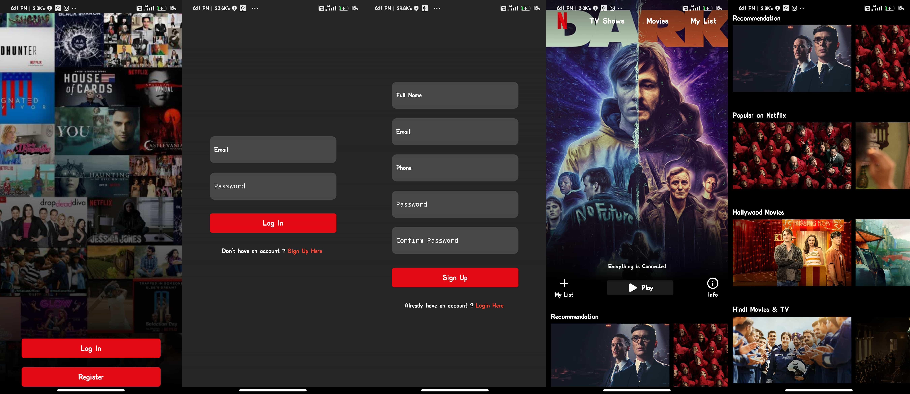

# netflix-clone
## Overview :
The goal is to build a clone app with the purpose of practice to develope a mobile application using React Native.



## Installation :
* Clone repository and install dependencies:
``` 
$ git clone https://github.com/kb-codes/netflix-clone.git
$ cd netflix-clone
$ npm i
```

* Run application :
```
$ npx react-native run-android
```
